Viz I
================

Import the weather data

``` r
data("weather_df")
```

Making our first plot :-)

``` r
ggplot(data=weather_df, mapping=aes(x=tmin, y=tmax)) +
  geom_point()
```

    ## Warning: Removed 17 rows containing missing values or values outside the scale range
    ## (`geom_point()`).

<!-- -->

``` r
weather_df |> 
  ggplot(aes(x=tmin, y=tmax))+
  geom_point()
```

    ## Warning: Removed 17 rows containing missing values or values outside the scale range
    ## (`geom_point()`).

<!-- -->

``` r
ggp_weather_scatterplot=
  weather_df |> 
  ggplot(aes(x=tmin, y=tmax))+
  geom_point()

ggp_weather_scatterplot
```

    ## Warning: Removed 17 rows containing missing values or values outside the scale range
    ## (`geom_point()`).

<!-- -->

Check that some rows are missing.

``` r
weather_df |> 
  filter(is.na(tmax))
```

    ## # A tibble: 17 × 6
    ##    name         id          date        prcp  tmax  tmin
    ##    <chr>        <chr>       <date>     <dbl> <dbl> <dbl>
    ##  1 Molokai_HI   USW00022534 2022-05-31    NA    NA    NA
    ##  2 Waterhole_WA USS0023B17S 2021-03-09    NA    NA    NA
    ##  3 Waterhole_WA USS0023B17S 2021-12-07    51    NA    NA
    ##  4 Waterhole_WA USS0023B17S 2021-12-31     0    NA    NA
    ##  5 Waterhole_WA USS0023B17S 2022-02-03     0    NA    NA
    ##  6 Waterhole_WA USS0023B17S 2022-08-09    NA    NA    NA
    ##  7 Waterhole_WA USS0023B17S 2022-08-10    NA    NA    NA
    ##  8 Waterhole_WA USS0023B17S 2022-08-11    NA    NA    NA
    ##  9 Waterhole_WA USS0023B17S 2022-08-12    NA    NA    NA
    ## 10 Waterhole_WA USS0023B17S 2022-08-13    NA    NA    NA
    ## 11 Waterhole_WA USS0023B17S 2022-08-14    NA    NA    NA
    ## 12 Waterhole_WA USS0023B17S 2022-08-15    NA    NA    NA
    ## 13 Waterhole_WA USS0023B17S 2022-08-16    NA    NA    NA
    ## 14 Waterhole_WA USS0023B17S 2022-08-17    NA    NA    NA
    ## 15 Waterhole_WA USS0023B17S 2022-08-18    NA    NA    NA
    ## 16 Waterhole_WA USS0023B17S 2022-08-19    NA    NA    NA
    ## 17 Waterhole_WA USS0023B17S 2022-12-31    76    NA    NA

\##Fancier scatterplots!

``` r
weather_df |> 
  ggplot(aes(x=tmin, y=tmax, color=name))+
  geom_point(alpha=0.3)+
  geom_smooth(se=FALSE)
```

    ## `geom_smooth()` using method = 'loess' and formula = 'y ~ x'

    ## Warning: Removed 17 rows containing non-finite outside the scale range
    ## (`stat_smooth()`).

    ## Warning: Removed 17 rows containing missing values or values outside the scale range
    ## (`geom_point()`).

<!-- -->

where you define aesthetics can matter

``` r
weather_df |> 
  ggplot(aes(x=tmin, y=tmax))+
  geom_point(aes(color=name, size=prcp),alpha=0.3)+
  geom_smooth(se=FALSE)
```

    ## `geom_smooth()` using method = 'gam' and formula = 'y ~ s(x, bs = "cs")'

    ## Warning: Removed 17 rows containing non-finite outside the scale range
    ## (`stat_smooth()`).

    ## Warning: Removed 19 rows containing missing values or values outside the scale range
    ## (`geom_point()`).

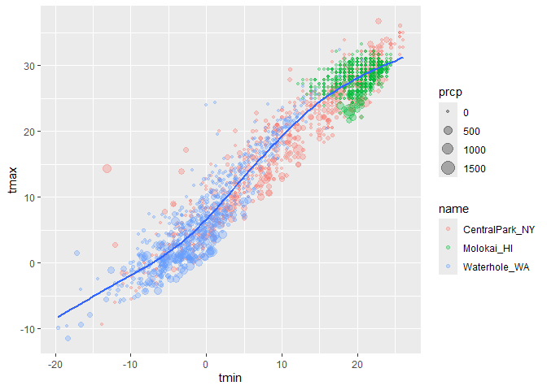<!-- -->

Use faceting real quick

``` r
weather_df |> 
  ggplot(aes(x=tmin, y=tmax))+
  geom_point(aes(color=name), alpha=0.3, size=0.8)+
  geom_smooth(se=FALSE)+
  facet_grid(. ~ name)
```

    ## `geom_smooth()` using method = 'loess' and formula = 'y ~ x'

    ## Warning: Removed 17 rows containing non-finite outside the scale range
    ## (`stat_smooth()`).

    ## Warning: Removed 17 rows containing missing values or values outside the scale range
    ## (`geom_point()`).

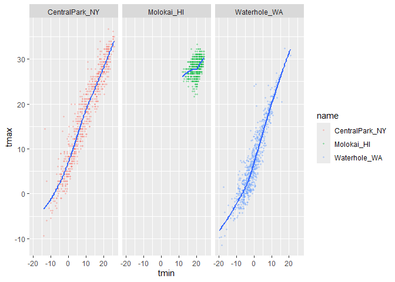<!-- -->

``` r
weather_df |> 
  ggplot(aes(x=tmin, y=tmax))+
  geom_point(aes(color=name), alpha=0.3, size=0.8)+
  geom_smooth(se=FALSE)+
  facet_grid(name ~ .)
```

    ## `geom_smooth()` using method = 'loess' and formula = 'y ~ x'

    ## Warning: Removed 17 rows containing non-finite outside the scale range
    ## (`stat_smooth()`).
    ## Removed 17 rows containing missing values or values outside the scale range
    ## (`geom_point()`).

<!-- -->

Let’s make a somewhat more interesting scatterplot

``` r
weather_df |> 
  ggplot(aes(x=tmin, y=tmax, color=name, shape=name))+
  geom_point(aes(size=prcp),alpha=0.3)+
  geom_smooth(se=FALSE)+
  facet_grid(. ~ name)
```

    ## `geom_smooth()` using method = 'loess' and formula = 'y ~ x'

    ## Warning: Removed 17 rows containing non-finite outside the scale range
    ## (`stat_smooth()`).

    ## Warning: Removed 19 rows containing missing values or values outside the scale range
    ## (`geom_point()`).

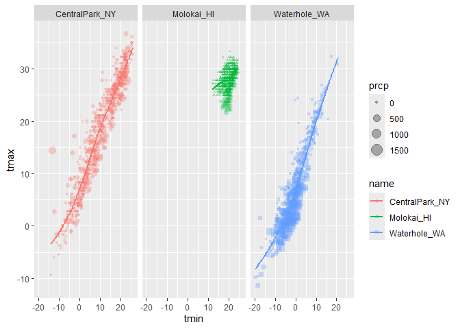<!-- -->

Leraning Assessment 1

``` r
weather_df |> 
  janitor::clean_names() |> 
  filter(name == "CentralPark_NY") |> 
  mutate(
    tmax_fahr = tmax * (9/5)+32,
    tmin_fahr = tmin * (9/5)+32 
    )|> 
  ggplot(aes(x=tmin_fahr, y=tmax_fahr))+
  geom_point()+
  geom_smooth(se=FALSE, method = "lm")
```

    ## `geom_smooth()` using formula = 'y ~ x'

<!-- -->

\##Small things

``` r
weather_df |> 
  ggplot(aes(x=tmin, y=tmax, color=name, shape=name))+
  #geom_point(alpha=0.3)+
  geom_smooth(se=FALSE)
```

    ## `geom_smooth()` using method = 'loess' and formula = 'y ~ x'

    ## Warning: Removed 17 rows containing non-finite outside the scale range
    ## (`stat_smooth()`).

<!-- -->

``` r
weather_df |> 
  ggplot(aes(x=tmin, y=tmax, color=name, shape=name))+
  geom_smooth(se=FALSE)+
  geom_point()
```

    ## `geom_smooth()` using method = 'loess' and formula = 'y ~ x'

    ## Warning: Removed 17 rows containing non-finite outside the scale range
    ## (`stat_smooth()`).

    ## Warning: Removed 17 rows containing missing values or values outside the scale range
    ## (`geom_point()`).

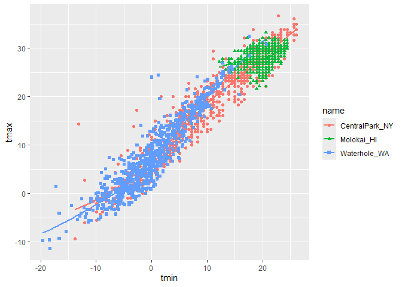<!-- -->

``` r
weather_df |> 
  ggplot(aes(x=tmin, y=tmax))+
  geom_hex()
```

    ## Warning: Removed 17 rows containing non-finite outside the scale range
    ## (`stat_binhex()`).

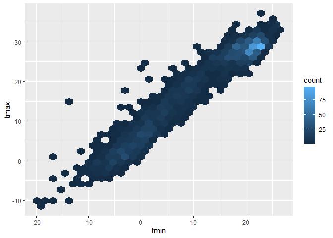<!-- -->

``` r
weather_df |> 
  ggplot(aes(x=tmin, y=tmax))+
  geom_point(color="purple")
```

    ## Warning: Removed 17 rows containing missing values or values outside the scale range
    ## (`geom_point()`).

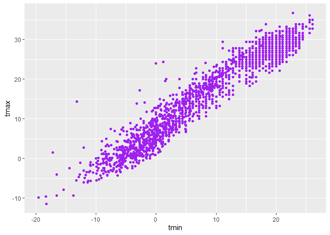<!-- -->

``` r
weather_df |> 
  ggplot(aes(x=tmin))+
  geom_histogram(color="white", fill= "blue")
```

    ## `stat_bin()` using `bins = 30`. Pick better value with `binwidth`.

    ## Warning: Removed 17 rows containing non-finite outside the scale range
    ## (`stat_bin()`).

<!-- -->

``` r
weather_df |> 
  ggplot(aes(x=tmin, color=name))+
  geom_histogram()
```

    ## `stat_bin()` using `bins = 30`. Pick better value with `binwidth`.

    ## Warning: Removed 17 rows containing non-finite outside the scale range
    ## (`stat_bin()`).

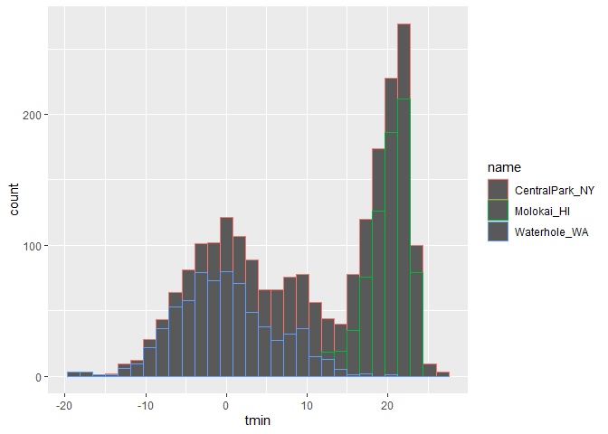<!-- -->

``` r
weather_df |> 
  ggplot(aes(x=tmin, fill=name))+
  geom_histogram()
```

    ## `stat_bin()` using `bins = 30`. Pick better value with `binwidth`.

    ## Warning: Removed 17 rows containing non-finite outside the scale range
    ## (`stat_bin()`).

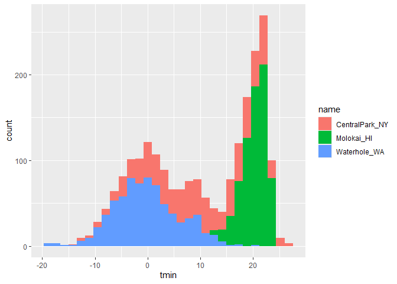<!-- -->

how would i fix this? maybe facet?

``` r
weather_df |> 
  ggplot(aes(x=tmin, fill=name))+
  geom_histogram()+
  facet_grid(name ~ .)
```

    ## `stat_bin()` using `bins = 30`. Pick better value with `binwidth`.

    ## Warning: Removed 17 rows containing non-finite outside the scale range
    ## (`stat_bin()`).

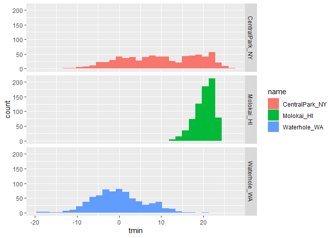<!-- -->

``` r
weather_df |> 
  ggplot(aes(x=tmin, fill=name))+
  geom_density(alpha=0.2)
```

    ## Warning: Removed 17 rows containing non-finite outside the scale range
    ## (`stat_density()`).

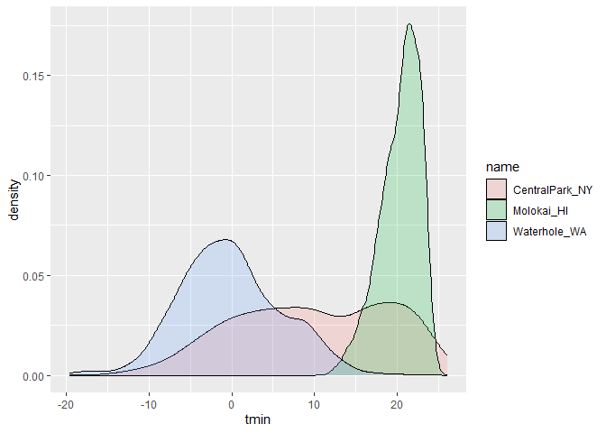<!-- -->

``` r
weather_df |> 
  ggplot(aes(x=name, y=tmin))+
  geom_boxplot(aes(fill=name))
```

    ## Warning: Removed 17 rows containing non-finite outside the scale range
    ## (`stat_boxplot()`).

<!-- -->

Violin plots

``` r
weather_df |> 
  ggplot(aes(x=name, y=tmin, fill=name))+
  geom_violin()
```

    ## Warning: Removed 17 rows containing non-finite outside the scale range
    ## (`stat_ydensity()`).

<!-- -->

ridge plot

``` r
weather_df |> 
  ggplot(aes(x=tmin, y=name, fill=name))+
  geom_density_ridges()
```

    ## Picking joint bandwidth of 1.41

    ## Warning: Removed 17 rows containing non-finite outside the scale range
    ## (`stat_density_ridges()`).

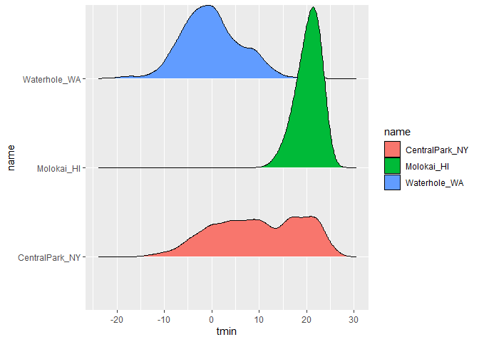<!-- -->

Learning Assessment 2

``` r
weather_df |> 
  janitor::clean_names() |> 
  ggplot(aes(x=prcp, fill=name))+
  geom_density(alpha=0.2)
```

    ## Warning: Removed 15 rows containing non-finite outside the scale range
    ## (`stat_density()`).

<!-- -->

``` r
weather_df |> 
  janitor::clean_names() |> 
  ggplot(aes(x=prcp, fill=name))+
  geom_histogram()+
  facet_grid(name ~ .)
```

    ## `stat_bin()` using `bins = 30`. Pick better value with `binwidth`.

    ## Warning: Removed 15 rows containing non-finite outside the scale range
    ## (`stat_bin()`).

<!-- -->

``` r
weather_df |> 
  janitor::clean_names() |> 
  filter(prcp>5, prcp<1000) |> 
  ggplot(aes(x=prcp, fill=name))+
  geom_density(alpha=0.2)
```

<!-- -->

\##Saving and embedding plots

Saving plots

``` r
ggplot_weather_violin = 
  weather_df |> 
  ggplot(aes(x=name, y=tmin, fill=name))+
  geom_violin()

ggplot_weather_violin
```

    ## Warning: Removed 17 rows containing non-finite outside the scale range
    ## (`stat_ydensity()`).

<!-- -->

``` r
ggsave("violin_plot.pdf", ggplot_weather_violin, width = 8, heigh = 6)
```

    ## Warning: Removed 17 rows containing non-finite outside the scale range
    ## (`stat_ydensity()`).
